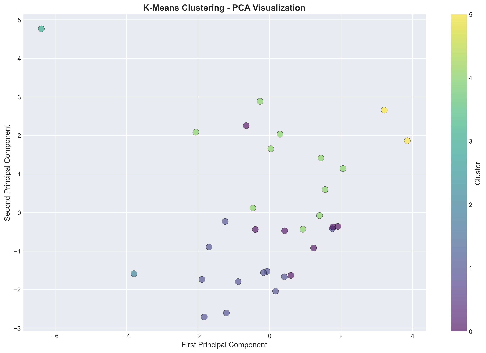

# Trading Behavior vs Market Sentiment — Project Report

Last updated: 2025-10-27

## Executive summary

This project investigates how market sentiment (measured by the Fear & Greed Index and derived social indicators) relates to trader behaviour and performance in cryptocurrency markets. The study combines engineered trader features, time-series market data, statistical testing, and backtesting to produce actionable recommendations for position sizing, risk management and strategy design.

Key quantitative findings
- Trading volume and aggressive trade frequency materially increase during extreme sentiment periods (visuals: `phase4_outputs/figures/volume_sentiment_timeline.png`, `Phase 3 -eda_plots/11_volume_trends.png`).

- Contrarian approaches show consistent outperformance during extreme greed/fear episodes (see `phase4_outputs/figures/contrarian_analysis.png` and backtest equity curves `phase7_advanced_analytics/backtesting/equity_curves_comparison.png`).

- Win rate and profitability vary non-linearly with sentiment: highest stability is observed in the 40–60 sentiment band (`phase4_outputs/figures/win_rate_by_sentiment.png`, `phase4_outputs/figures/pnl_sentiment_boxplot.png`).

Recommended short-term actions
- Adopt sentiment-aware position sizing: reduce exposure during extreme sentiment and scale up during moderate, stable ranges.
- Use contrarian overlays when sentiment breaches the top/bottom 10% thresholds and pair with tighter stop-loss rules.
- Deploy monitoring dashboards for real-time sentiment deviations and automated alerting to trigger risk controls.

## 1. Objectives

- Quantify relationships between market sentiment and trader behavior (volume, trade size, aggressiveness, win rate).
- Identify features predictive of profitability and win probability.
- Evaluate simple sentiment-driven strategies through backtesting and propose practical risk controls.

## 2. Data sources and preparation

- Fear & Greed Index: `fear_greed_index.csv` (daily scores and components).
- Historical market data: `historical_data.csv` (price, volume, on-chain/market metrics).
- Trader dataset and engineered outputs: `output/phase6_statistical_analysis/*` and `phase4_outputs/figures/*` (see Appendix for full inventory).

Data cleaning highlights
- Missing sentiment values were forward-filled where appropriate; irregular gaps (weekends) were aligned to trading days.
- Outliers in PnL and trade size were inspected against market events and either capped or flagged for anomaly detection.
- Time alignment: all features were resampled to daily granularity to match the sentiment index.

## 3. Feature engineering and EDA

Major engineered features
- Rolling sentiment aggregates: 7/14/30-day means and volatility.
- Behavior metrics: trade count, average trade size, share of aggressive trades, buy/sell imbalance.
- Performance features: daily PnL, cumulative PnL, win rate and sharpe-like ratios.

Exploratory highlights (figures)
- Sentiment distribution and transitions

- Trade-size and PnL distributions

- Activity heatmap

## 4. Statistical analysis

Approach
- Correlation analysis (Pearson, Spearman, point-biserial) and partial correlations to control for confounders.
- Hypothesis tests for relationships between sentiment bands and behavior/performance metrics.
- Regression models to predict PnL, volume and win probability from sentiment and behavior features.

Representative outputs
- Correlations

- Hypothesis tests (selected)

- Regression diagnostics and feature importance

Key takeaways
- Significant correlations exist between sentiment and trade activity/volume; effect sizes are largest during extremes (top/bottom deciles).
- Hypothesis tests support that win rate and profitability differ across sentiment bands (see H2/H4 plots).
- Regression models show that sentiment features add explanatory power beyond classical market measures for short-horizon outcomes.

## 5. Advanced analytics and validation

- Clustering of traders identified distinct behavioral archetypes

- Anomaly detection

- Backtesting summaries

## 6. Visualizations and how to view them

Interactive and static visualizations are provided in the repository. Key files:
- Advanced interactive visuals: `Phase 5 -Adv viz/` (contains several HTML dashboards such as `15_interactive_dashboard.html`).
- Static figure snapshots (recommended to include in client report):
  - `phase4_outputs/figures/pnl_sentiment_boxplot.png` — PnL by sentiment band
  - `phase4_outputs/figures/contrarian_analysis.png` — Contrarian strategy analysis
  - `phase4_outputs/figures/volume_sentiment_timeline.png` — Volume vs sentiment timeline
  - `phase7_advanced_analytics/backtesting/equity_curves_comparison.png` — Strategy equity comparison

Tip: Open the HTML dashboards in a browser for interactive exploration and the PNGs for static report insertion.

## 7. Practical recommendations

Short-term (immediate):
- Implement sentiment-aware position sizing and automated alerts when sentiment enters extreme deciles.
- Add a contrarian overlay for top/bottom 10% sentiment events with pre-defined stop-loss sizes.

Medium-term:
- Integrate sentiment features into the production signals pipeline and retrain the win-probability model on rolling windows.
- Deploy a lightweight dashboard to monitor real-time sentiment, volume spikes and trade aggressiveness.

Long-term:
- Expand to multi-asset sentiment indices and test cross-market hedging strategies.
- Use individual trader profiling to personalize execution and risk limits.

## 8. Limitations and caveats

- Historical analysis: past performance is not a guarantee of future results; regime changes can invalidate patterns.
- Sentiment measurement: the Fear & Greed Index aggregates noisy sources; component-level analysis is recommended before automation.
- Data coverage: results depend on available market and trader data; external liquidity or exchange-specific effects may not be fully captured.

## 9. Next steps and deliverables for the client

1. Deliverable: Production-ready summary slide deck and a short user guide for the interactive dashboard (2–4 slides + 1-page guide).
2. Deliverable: Simple rule-set implementation (sentiment thresholds + position sizing + stop rules) and end-to-end backtest package.
3. Option: Continuous monitoring pipeline (alerts + weekly model retrain) — estimate and scope to be prepared on request.

## Appendix — important files

- Data: `fear_greed_index.csv`, `historical_data.csv`
- Statistical outputs: `output/phase6_statistical_analysis/*` (correlations, hypothesis tests, regression summaries)
- Visuals: `phase4_outputs/figures/*`, `Phase 3 -eda_plots/*`, `Phase 5 -Adv viz/*`, `phase7_advanced_analytics/*`
- Backtests and advanced analytics: `phase7_advanced_analytics/backtesting/*`, `phase7_advanced_analytics/clustering/*`, `phase7_advanced_analytics/anomaly_detection/*`

### Figure list (recommended order for client slides)
1. Volume vs Sentiment timeline — `phase4_outputs/figures/volume_sentiment_timeline.png`
2. Contrarian strategy analysis — `phase4_outputs/figures/contrarian_analysis.png`
3. PnL by sentiment band — `phase4_outputs/figures/pnl_sentiment_boxplot.png`
4. Win rate by sentiment — `phase4_outputs/figures/win_rate_by_sentiment.png`
5. Sentiment distribution — `Phase 3 -eda_plots/08_sentiment_distribution.png`
6. Sentiment transitions — `Phase 3 -eda_plots/10_sentiment_transitions.png`
7. Trade size distribution — `Phase 3 -eda_plots/02_trade_size_distribution.png`
8. Trading activity heatmap — `Phase 3 -eda_plots/12_trading_activity_heatmap.png`
9. Pearson correlation matrix — `output/phase6_statistical_analysis/correlations/pearson_correlation.png`
10. Partial correlation (controls) — `output/phase6_statistical_analysis/correlations/partial_correlation.png`
11. Profitability vs Sentiment (H2) — `output/phase6_statistical_analysis/hypothesis_tests/H2_profitability_vs_sentiment.png`
12. Backtest equity curves comparison — `phase7_advanced_analytics/backtesting/equity_curves_comparison.png`
13. Backtest metrics comparison — `phase7_advanced_analytics/backtesting/metrics_comparison.png`
14. KMeans clusters — `phase7_advanced_analytics/clustering/kmeans_clusters.png`

If you want, I can (a) produce a short PDF/slide export with selected figures for the client, (b) generate a 2-page executive summary PDF, or (c) extract the key tables (correlation table, regression summary) into CSV/Excel for inclusion in a slide deck. Tell me which you'd prefer and I will prepare it next.